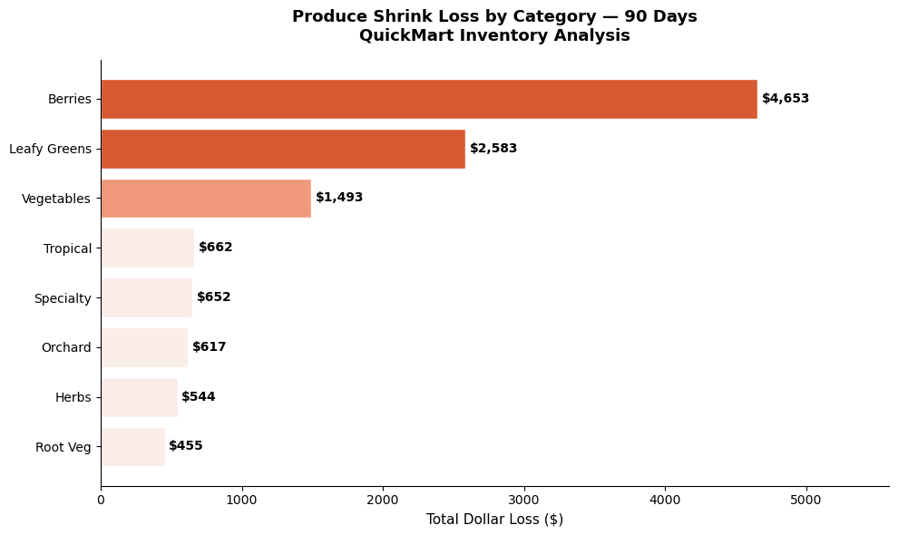
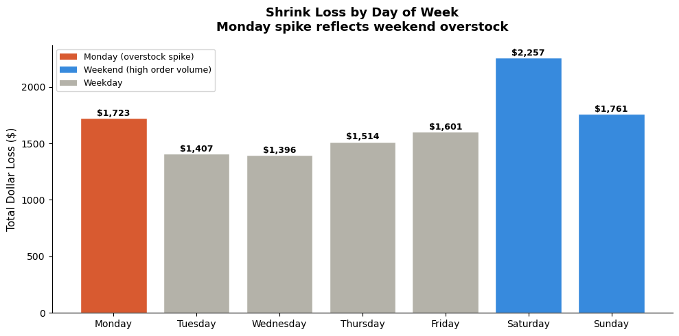
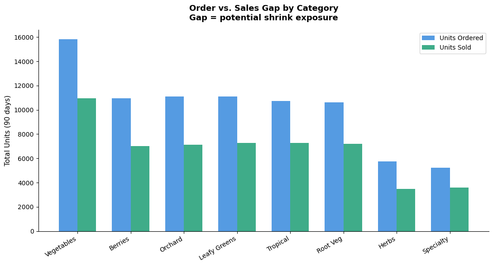

# case-study-03-produce-shrink-analysis
**Author:** Jeffrey Arzu  
**Platform:** Zerve + Jupyter Notebook  
**Date:** June 2026  

---

## Business Problem

Shrink — the gap between units ordered and units actually sold — is one 
of the most controllable cost drivers in a grocery produce department. 
Most small and mid-size retailers manage it by gut feeling alone, with 
no systematic way to identify which categories bleed the most or which 
days of the week create the highest waste risk.

This project quantifies produce shrink across 90 days of inventory data 
to identify where losses are concentrated and what operational changes 
could reduce them.

---

## Dataset

Synthetic dataset generated in Python, modeled after real produce 
department operations and shelf-life patterns observed in grocery retail.

| Table | Records | Description |
|---|---|---|
| Products | 15 SKUs | 8 categories with shelf life values |
| Sales | 1,350 rows | Daily units sold and revenue over 90 days |
| Shrink | 1,350 rows | Units ordered, sold, wasted, dollar loss, waste reason |

**Date range:** January 1 – March 30, 2024  
**Tools:** Python, pandas, NumPy, matplotlib

---

## Key Findings

**1. Berries and Leafy Greens drive 61% of total shrink loss**  
Despite not being the highest-volume categories, their 4–5 day shelf 
life severely punishes over-ordering. Berries alone account for nearly 
$4,400 in losses over 90 days — almost 10x more than Root Vegetables.

**2. Monday is consistently the highest shrink day of the week**  
Stores over-order on Fridays for anticipated weekend demand, sell less 
than projected, and absorb the spoilage Monday morning. This pattern 
is consistent across all short-shelf-life categories.

**3. The order-vs-sold gap is largest in short shelf-life categories**  
Root Vegetables show the tightest gap — their long shelf life means 
unsold units carry forward rather than becoming immediate waste. 
Short-shelf-life categories need tighter ordering windows.

---

## Recommendations

1. Reduce berry and leafy green order quantities on Thursdays and Fridays 
by 10–15% to account for weekend sell-through uncertainty.

2. Implement a Monday shrink review process — flag any category where 
Monday waste exceeds 25% of weekly shrink budget and trace back to 
Friday order decisions.

3. Prioritize markdown pricing on Saturday afternoons for short-shelf-life 
items rather than holding full price and absorbing Sunday/Monday waste.

---

## Visualizations

### Shrink Loss by Category

### Shrink by Day of Week

### Order vs Sold Gap

---

## Project Structure
case-study-03-produce-shrink-analysis/
├── produce_shrink_analysis.ipynb
├── shrink_by_category.png
├── shrink_by_day.png
├── order_vs_sold_gap.png
└── README.md

---

*Synthetic dataset modeled after real produce department operations. 
Shrink rates and shelf-life values reflect observable grocery retail behavior.*
